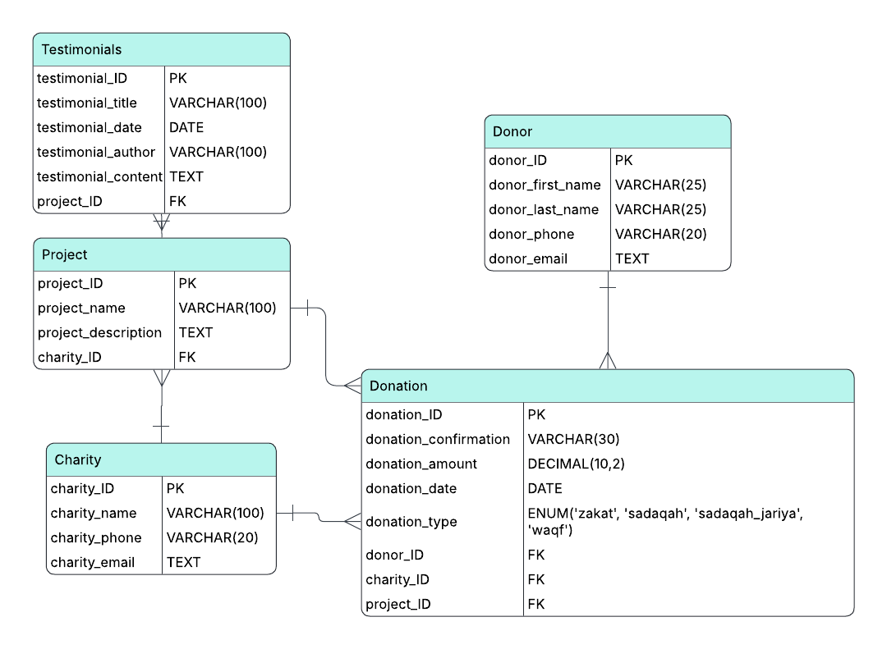

# NiyyahTrack — Zakat & Charity Analytics Pipeline

A cloud-native analytics engineering pipeline for tracking Islamic charitable giving. NiyyahTrack transforms raw donation data into structured models and business metrics that measure the impact and efficiency of charitable initiatives.

---

## v2 — Cloud Pipeline (Current)

v2 migrates the full pipeline from local PostgreSQL to Google Cloud Platform, introducing BigQuery as the data warehouse and Apache Airflow as the orchestration layer.

### What Changed

| | v1 (PostgreSQL) | v2 (BigQuery + Airflow) |
|---|---|---|
| Storage | Local PostgreSQL | Google BigQuery |
| Orchestration | Manual | Apache Airflow (Dockerized) |
| Seeding | psycopg2 script | BigQuery Python client |
| Transformation | dbt-postgres | dbt-bigquery |
| Auth | Password | Application Default Credentials (ADC) |
| Schedule | On demand | Daily (automated) |

### Architecture

```
seed.py (Faker + BigQuery client)
    │
    ▼
BigQuery: niyyahtrack dataset
    │  raw tables: donor, charity, project, testimonials, donation
    │
    ▼
dbt run (staging → marts)
    │  stg_donors, stg_charity, stg_project, stg_testimonials, stg_donation
    │  dim_donors, dim_projects, fct_donations
    │
    ▼
dbt test (data quality validation)

All three steps orchestrated daily by Apache Airflow
```

### Tech Stack (v2)

- **Google BigQuery** — cloud data warehouse
- **Apache Airflow** (Docker + CeleryExecutor) — pipeline orchestration and scheduling
- **dbt** (dbt-bigquery) — data transformation and modelling
- **Python** (Faker, google-cloud-bigquery, pandas) — synthetic data generation and BigQuery loading
- **Docker** — containerized Airflow environment

### Airflow DAG

The `niyyahtrack_dbt` DAG runs daily and orchestrates three tasks in sequence:

```
seed_bigquery → dbt_run → dbt_test
```

- **seed_bigquery** — generates 50 rows per table using Faker and loads to BigQuery with `WRITE_TRUNCATE`
- **dbt_run** — executes staging and mart models against BigQuery
- **dbt_test** — validates data quality (nulls, uniqueness, referential integrity)

### Setup (v2)

#### Prerequisites
- Docker Desktop
- Google Cloud account with BigQuery API enabled
- gcloud CLI installed and authenticated

#### 1. Authenticate with GCP
```bash
gcloud auth application-default login \
  --scopes="https://www.googleapis.com/auth/cloud-platform"
```

#### 2. Create BigQuery dataset
In GCP Console → BigQuery → create a dataset named `niyyahtrack`.

#### 3. Configure dbt profile
In `~/.dbt/profiles.yml`:
```yaml
niyyah_dbt:
  target: dev
  outputs:
    dev:
      type: bigquery
      method: oauth
      project: your-gcp-project-id
      dataset: niyyahtrack
      threads: 4
      timeout_seconds: 300
      location: US
```

#### 4. Build and run
```bash
docker compose build
docker compose up -d
```

#### 5. Trigger the DAG
Open `http://localhost:8080`, find `niyyahtrack_dbt`, and trigger manually or let it run on its daily schedule.

---

## v1 — Local Pipeline (Original)

The original version of NiyyahTrack was built on PostgreSQL and dbt-postgres, focused on designing the relational schema and analytics layer from scratch.

### Tech Stack (v1)

- **PostgreSQL** — relational database for raw data storage
- **Python** (psycopg2, Faker) — synthetic data generation and database seeding
- **dbt** (dbt-postgres) — data transformation and modelling
- **pgAdmin 4** — database management and query execution

### Data Model

The system is built around the following core entities:

- **Projects** — charitable initiatives
- **Donations** — contributions made toward projects
- **Donors** — individuals making donations
- **Testimonials** — qualitative feedback linked to projects

### ERD



### dbt Pipeline

Layered dbt architecture:

**1. Staging Layer:** 5 models — one per raw table

**2. Mart Layer**
- `dim_donors` — donor dimension table
- `dim_projects` — project dimension table with charity name joined in
- `fct_donations` — fact table joining donations with donor, project, and charity info

### Analysis Queries

Five analysis queries built on top of `fct_donations`:

1. **Total raised per project** — which projects attract the most donations
2. **Total donations by type** — breakdown across zakat, sadaqah, sadaqah jariya, waqf
3. **Total raised per charity** — which charities raise the most
4. **Repeat donors** — donors who gave more than once (retention metric)
5. **Cost per beneficiary** — total raised per project divided by number of testimonials (impact metric)

```sql
-- Cost per beneficiary
WITH total_donations AS (
    SELECT project_name, SUM(donation_amount) AS total_raised
    FROM fct_donations
    GROUP BY project_name
),
count_testimonials AS (
    SELECT COUNT(testimonial_id) AS testimonial_count, p.project_name
    FROM stg_testimonials s
    JOIN dim_projects p ON s.project_id = p.project_id
    GROUP BY p.project_name
)
SELECT c.project_name, total_raised, testimonial_count,
    ROUND(total_raised/testimonial_count::numeric, 2) AS cost_per_beneficiary
FROM count_testimonials c
JOIN total_donations ON c.project_name = total_donations.project_name
```

### Key Metric

**Cost per Beneficiary** — a derived metric to evaluate charitable project efficiency:
`cost_per_beneficiary = total_donations ÷ number_of_testimonials`

### Setup (v1)

#### Prerequisites
- PostgreSQL 16+
- Python 3.11+
- dbt-postgres

#### Installation
```bash
pip install psycopg2-binary faker python-dotenv dbt-postgres
```

#### Environment Variables
Create a `.env` file in the project root:
```
DB_PASSWORD=your_postgres_password
```

#### Database Setup
```bash
\i sql/schema.sql
```

#### Seed Data
```bash
python data/seed.py
```

#### dbt
```bash
cd niyyah_dbt
dbt run
```

---

## Key Learnings

- Migrated a local PostgreSQL pipeline to a fully cloud-native GCP architecture
- Configured Application Default Credentials (ADC) for secure Airflow ↔ BigQuery authentication
- Orchestrated a multi-step data pipeline (seed → transform → test) using Apache Airflow with CeleryExecutor
- Applied layered dbt modeling (staging → marts) on BigQuery using `source()` and `ref()`
- Dockerized the full Airflow environment with custom image builds and volume mounts
- Designed business-oriented metrics (cost per beneficiary, donation type breakdown) for charitable impact analysis
- Built an end-to-end analytics pipeline from schema design to cloud deployment
